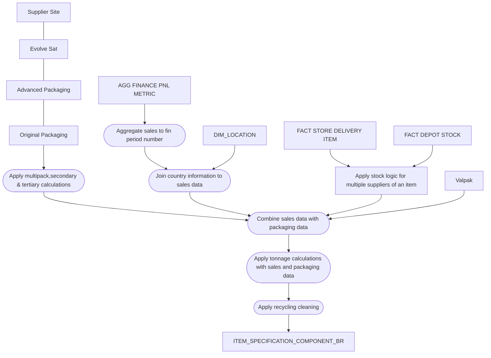

# ITEM_SPECIFICATION_COMPONENT_BR

**Last Edited: 21/04/2022**

## Description

This object is the atomic level bridge table for packaging. Containing both Evolve Food and Valpak, this performs all the cleaning and calculations that need to take place prior to being consumed in the PL layer. This object supports `FACT_ITEM_SPECIFICATION_COMPONENT` and `AGG_ITEM_PRIMARY_PLASTICS`.

## Jira Tickets

| Jira Ticket | Description | Function |
|-------------|-------------|----------|
|[PFBP_295](https://sainsburys-jira.valiantys.net/browse/PFBP-295)| Core object build |Engineering|
|[PFBP_381](https://sainsburys-jira.valiantys.net/browse/PFBP-381)| Analysis for adding in fulfilment channel and calendar reporting | Architecture

## Selection Criteria

This BDV object contains two sources, as a result we must identify which data we want to take from each source and ensure no duplication in the data. We are also only concerned with own brand items. Valpak is GM, plus loose food & bakery, Evolve is all other food items. Filter criteria is based from ADW_PRODUCT_PL.DIM_ITEM

**Own Brand Criteria**
```
OWN_BRAND_FLAG = 'Y'
```
**Valpak Criteria**
```
BUSINESS_UNIT_CD IN (5699,3210)
SUB_CAT_CD IN (184,319,325,350,353,438,468,502,503,533,607,654,849,850,856,876,877,880,881,882,883,884,886,887,888,889,891,892,893,894,895,896,912,913,929,943)  
ELSE SUB_CAT_CD
```
**Evolve Criteria**
```
BUSINESS_UNIT_CD IN (5699,3210)
SUB_CAT_CD NOT IN (184,319,325,350,353,438,468,502,503,533,607,654,849,850,856,876,877,880,881,882,883,884,886,887,888,889,891,892,893,894,895,896,912,913,929,943)
```

## Target to Source

These tables are assumed to be unioned in the spec and will have the name OP, AP and VALPAK as aliases:

* `ADW_PRODUCT_TRAN.ITEM_PACKAGING_COMPONENT_VALPAK_HIST_BR_LOGIC_2` as `VALPAK`
* `ADW_RDV.ADVANCED_PACKAGING_COMPONENT_LINK` as `AP`
* `ADW_RDV.ITEM_SPECIFICATION_ITEM_PACKAGING_COMPONENT_LINK` as `OP`

Target system for this object is ADW_BDV.

{{ read_excel('/Users/matt.wilkinson/Desktop/Mapping Spec Git.xlsx', engine='openpyxl', sheet_name="Target to Source") }}

## Mapping Steps

1. Filter both Valpak and Evolve sources with the supporting logic given to ensure correct data and no duplication into the final table.
1. Combine original packaging, advanced packaging, supplier site & evolve sat to obtain the necessary packaging data.
1. Apply calculations and transformations on packaging data weights. See calculations section for more detail. 
???+ example "Calculations"
    **Secondary**  
    An item has secondary packaging, this is not sold to the consumer and will be for example a box containing multiple skus. We must divide the weight of this secondary component to give an actual value sold per item as to not inflate the overall packaging weight of the item.
    ```
    COMPONENT_WEIGHT / CASE_CRATE_SHIPPER_QTY
    Example :
    Case component weight = 352.59 g
    Case crate shipper quantity = 12
    Secondary Calculated weight = 352.59/12 = 29.3 g
    ```
    **Tertiary**  
    Similar to the secondary calculation there is also tertiary packaging. This will usually be the pallet and any materials used to secure the pallet. Again we need to divide the weights to provide a correct weight per item.
    ```
    COMPONENT_WEIGHT / (CASE_CRATE_SHIPPER_QTY * TOTAL_CASES_PER_PALLET_LAYER_QTY)
    Example :
    Stretch Wrap component weight = 250
    Case crate shipper quantity = 12
    Case crate total cases per pallet = 42
    Tertiary Calculated weight = 250/(12*42) = 0.49603 g
    ```
    **Multipack Calculation**  
    This is the opposite of the previous two calculations. When we sell multipacks the weight assigned is only equivalent to one item. In this case we must multiply the weight by the no. of items in the pack.
    ```
    CONSUMER_PACK_QTY * COMPONENT_WEIGHT
    Example :
    Component weight from Evolve for bottle = 34 gm
    Calculated Weight for Bottle = 4 * 34 gm = 136 gm
    ```
    **Recycled Weight Calculation**
    ```
    Calculated Recycled Content Weight =% Recycled Content * Calculated Component Weight
    ```
    **Multiple supplier component Calculation**  
    A spefication and version has multiple suppliers of a component, for example in our data we will have three entries against a bottle, however only one bottle will have sold in the store. Therefore we have to take this into consideration when building both fact views. For packaging we have worked out the average value of the three components, then divided by the no. of components to give an accurate figure when rolling up to the views consumed by the business:
    ```
    Bottle 32g,Bottle 36g, Bottle 33g
    Average value = 33.6 g / 3 = 11.2 g
    ```
1. Aggregate sales volume from tran_dt to fin period num.
1. Add in country data to sales volume by looking up sales_initiated_cd against location_cd in dim_location.
1. Apply stock and sales logic for weighting multiple suppliers of an item. See business rules for more detail.
1. Combine sales data with packaging data.
1. Apply tonnage calculations with sales and packaging data.
1. Apply recycling advice cleaning to Evolve & Valpak. Lookup adw_product_tran.evolve_valpak_recycle_advice_ref and return the cleaned column in the table output.
1. Load transform schema to table.
1. End.

## Diagram



## Tests & Checks

- [x] Secondary & Tertiary calculations applied
- [x] Multipack calculations applied
- [x] Supplier weighting applied
- [x] Sales volume is the same in br table as source
- [x] Tonnage and recycled tonnage calculations are verified
