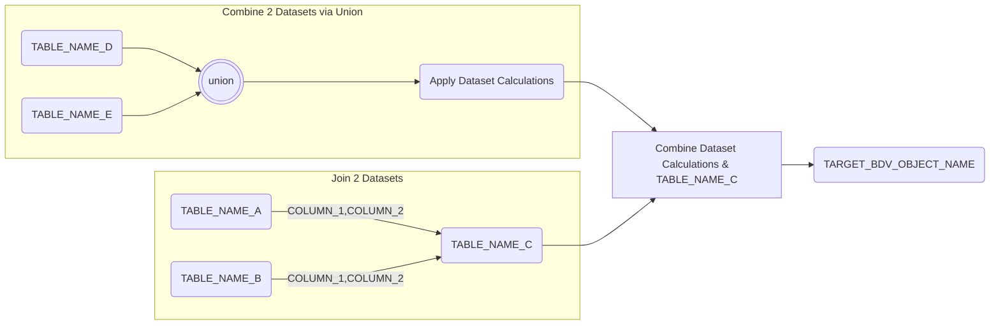

# INSERT BDV OBJECT NAME HERE

**Last Edited: DD/MM/YYYY**

## Description

Provide a brief description of the BDV object, include any specifics around the business context and PL objects dependent as applicable.

## Jira Tickets

| Jira Ticket | Description | Function |
|-------------|-------------|----------|
|[Include JIRA Ticket number & URL](https://sainsburys-jira.valiantys.net)| High Level Description |Involved Function. E.g. Engineering, Architecture|

## Selection Criteria

Provide detailed description of the sources used to populate the BDV Object. Include the business entities that link to the sources used with examples, plus any filters applied while ingesting from source. Include details of any RDV/BDV objects used to populate this BDV object.

**Source Criteria**
```
Include filters applied here.
Duplicate this section if multiple filters apply.
```

## Target to Source

Include the table names to be combined and mapped in the specification.
You can use aliases such as:

* `<SCHEMA_NAME>.<TABLE_NAME>` as `A`
* `<SCHEMA_NAME>.<TABLE_NAME>` as `B`

Target system for this object is ADW_BDV.

{{ read_excel('..//Mapping Spec Git.xlsx', engine='openpyxl', sheet_name="BDV_OBJECT_NAME") }}

## Mapping Steps

1. Create steps to detail how the data is selected correctly, including but not limited to: Data cleansing, De-duplication & Business rules applied.
2. For example, any cleansing steps can be documented through code blocks, as can be seen in the below example.
    1. Data Cleansing
        1. ???+ warning "Dataset Cleaning - Duplicate each of the sections below based on the complexity of logic"
            **Remove Dummy Data**
            ```
            Remove COLUMN_NAME= "" when COLUMN_NAME contains "DO NOT USE"
            ```
            **Clean Source Data**
            ```
            Trim COLUMN_NAME having leading/trailing spaces
            Remove specific pattern based values found in COLUMN_NAME
            ```
1. Apply calculations based on the relevant business logic. See calculation section below for more detail:
    1. ???+ example "Calculations - Duplicate each of the sections below based on the complexity of logic and number of calculated attributes/metrics"
        **Calculation 1**  
        Provide a definition of the calculated metric and business logic applicable for the same.
        ```
        Provide the logic/formula used for the calculation - Include the column names used as well.
        Example :
        Provide an example based on values from dependent columns to explain the desired outcome for the calculation.
        ```
        **Calculation 2**  
        Provide a definition of the calculated metric and business logic applicable for the same.
        ```
        Provide the logic/formula used for the calculation - Include the column names used as well.
        Example :
        Provide an example based on values from dependent columns to explain the desired outcome for the calculation.
        ```
1. Document any logic involving combining datasets at various points of the mapping steps using the section below:

    1. ???+ info "Table Logic"
        ```
        Lookup TABLE_NAME_A USING COLUMN_A & COLUMN_B to retrieve COLUMN_C
        Combine TABLE_NAME_A & TABLE_NAME_B using COLUMN_A & COLUMN_B
        ```
1. Combine all of the above datasets.
1. Load transform schema to table.
1. End.

## Diagram



## Tests & Checks
Original Tests (These are based on the mapping steps):

- [x] Calculations Applied (Duplicate as required with specifics)
- [x] Business Logic Applied (Duplicate as required with specifics)
- [x] BDV Reconciles with Source/Equivalent Datasets based on set criteria
- [x] Calculations verified & signed off by Business/End User

New Tests (To be defined post handover - Duplicate as required):

- [ ] New Test Scenario 1
- [ ] New Test Scenario 2
- [ ] New Test Scenario 3
- [ ] New Test Scenario 4