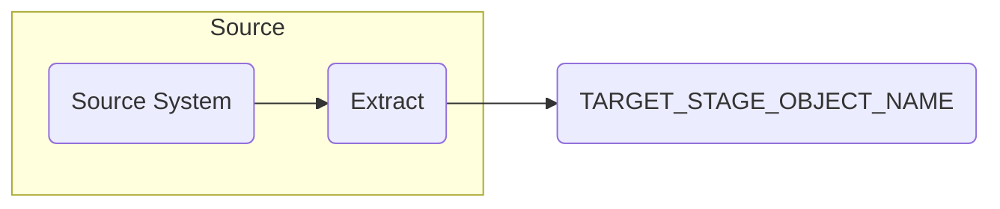

# INSERT STAGE OBJECT NAME HERE

**Last Edited: DD/MM/YYYY**

## Description

Provide a brief description of the stage table, include specifics of source and the use case for ASPIRe.

## Jira Tickets

| Jira Ticket | Description | Function |
|-------------|-------------|----------|
|[Include JIRA Ticket number & URL](https://sainsburys-jira.valiantys.net)| High Level Description |Involved Function. E.g. Engineering, Architecture|

## Diagram

