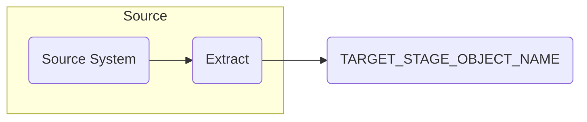

# INSERT STAGE OBJECT NAME HERE

**Last Edited: DD/MM/YYYY**

## Description

Provide a brief description of the stage table, include specifics of source and the use case for ASPIRE.

## Diagram

```mermaid
flowchart LR
subgraph "Source"
d("Source System")
e("Extract")
d-->e
end
u(TARGET_STAGE_OBJECT_NAME)
e-->u
```