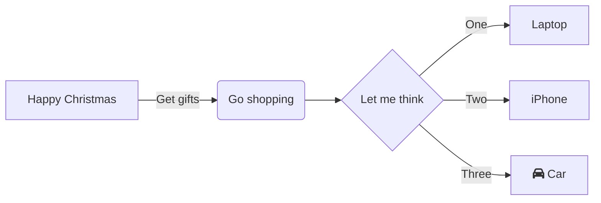

# FDBK_CSAT_SURVEY_REP

**Last Edited: 04/07/2023**

## Description
This table contain survey response details for each CSAT survey that has been completed by a customer. This table contains all of the header data for an individual response, including the date of the visit, the date of the survey and the store visited (where relevant). If available a link to the survey responder's Nectar account is also available. There will be one row in this table for each survey response. This table is used to populate FLF_CSAT_SURVEY with survey responses.

## Selection Criteria

This BDV object contains two sources (SMG Survey and Qualtrics Survey), as a result we must identify which data we want to take from each source and ensure no duplication in the data. 

**Valid Records from RDV**
```
RECORD_DELETED_FLAG_FLAG = 'N'
```
**Survey Project Criteria**
```
SURVEY_PROJECT_ID IN (
'SMG_INSTORE',           -- SMG Instore Survey (Historical)
'SMG_ONLINE',            --SMG GOL Survey (Historical)
'SMG_POPUP',             --SMG Popup Survey (Historical)
'SMG_FEEDBACK',          --SMG Feedback Survey (Historical)
'SV_cZnMPk9qqMRo5fL',    --Lettuce Know - Instore
'SV_6MtlOGAxp9i54GO',    --Sainsbury's - GOL Delivery
'SV_5okht3tJXHtv0ma',    --Sainsburys - Pop Up Survey
'SV_0eXofGHBALFYUwC',    --Sainsburys - Feedback button
'SV_5bsA1xNDWa2My8t',    --Tu CSAT
'SV_5oODvo2t9M3Na5L',    --Contact Centre: Habitat post call SMS survey
'SV_6eTJrAcmCQvLf5b',    --Contact Centre: Tu Clothing post call SMS survey - Argos
'SV_24DeJwD5LkUQxoy',    -- Contact Centre: Argos Deflection post call SMS survey
'SV_87dKDEgmCsxovSl',    --Contact Centre: Sainsbury's Careline post call SMS survey
'SV_a3K1kBQbqNMvcbP',    --Contact Centre: Sainsbury's GOL post call SMS survey
'SV_bqPEsEHROd17xum',    --Contact Centre: Nectar post call SMS survey
'SV_cFOhrO8drcUbDa5',    --Contact Centre: Argos post call SMS survey
'SV_6VDlpwWS8tuYjD8',    --Argos Installation SMS Survey
'SV_2rSvStLzycecZOm',    --Argos Popup Survey 
'SV_8B9js5zeIDa9UV0',    --Argos Feedback Survey
'SV_9vl3g4QgMWDwyuG',    --Argos Driver Feedback SMS Survey
'SV_3UJeDf9c1VsHVYO'     --Argos E2E Survey
)
```
## Target to Source

These tables are assumed to be unioned and/or Left Join in the spec and will have the name FSL, FSQS, NCCPUL, STML, FSAL, FSAML, MTHL and DS as aliases:

* `FDBK_SURVEY_LINK` as `FSL`
* `FDBK_SURVEY_QUALTRICS_SAT` as `FSQS`
* `NCTR_CLLCTR_CRD_PF_URN_LINK` as `NCCPUL`
* `SALES_TRANSACTION_MEASURE_LINK` as `STML`
* `FDBK_SURVEY_ANSWER_LINK` as `FSAL`
* `FDBK_SURVEY_AMEND_METADATA_LINK` as `FSAML`
* `MISSION_TRANS_HDR_LINK` as `MTHL`
* `DIM_STORE_SMART_SHOP_TYPE_HIST` as `DSSSTH`
* `DIM_STORE` as `DS`


Target system for this object is ADW_BDV.

{{ read_csv("./docs/csv/fdbk-csat-survey-rep.csv") }}

## Mapping Steps

1. Filter both SMG and Qualtrics sources using the selection criteria given to ensure correct data and no duplication into the final table. Ensure only those Survey Project ID's listed above are in this table.
1. Get the NECTAR_COLLECTOR_CARD_NUM for these Survey Project's only if available: 
If it is not available then default to NULL. 
1. Get the TRANSACTION_KEY i available for these Survey Project's only if available:
If it is not available then default to NULL. 
1. Get the STORE_CD
1. Get the TILL_NUM
1. Get the TRAN_DT
1. Get the TRAN_TM
1. Get the TRAN_NUMBER
1. Get the SURVEY_TYPE
1. Get the VISIT_DATE
1. Get the VISIT_HOUR
1. Get the TILL_TYPE_ID
1. Get the SURVEY_DATETIME
1. Get the SURVEY_DATE
1. Get the SURVEY_HOUR
1. Get the UNIT_LOCAL_DATETIME
1. Get the INVITE_TYPE
1. Get the OVERALL_CSAT_SCORE
1. Get the PF_URN
1. Get the ORDER_NUMBER
1. Get the AMOUNT_SPENT
1. Get the FAV_STORE_CD
1. Get the GENDER
1. Get the DEPARTMENT
1. Get the DEPARTMENT1
1. Get the DEPARTMENT2
1. Get the COUNTER
1. Get the LIFE_STAGE
1. Get the START_DATE
1. Get the END_DATE
1. Get the TIME_OF_TRANSACTION
1. Get the TIME_BAND
1. Get the STATUS
1. Get the PROGRESS
1. Get the DURATION
1. Get the FINISHED
1. Get the DELIVERY_METHOD
1. Get the PETROL_FILLING_STATION
1. Get the DELIVERY_PASS
1. Get the EQ_DEF
1. Get the REPORT_CHANNEL
1. Get the SMART_SHOP_TYPE
1. Get the SURVEY_BRAND
1. Get the TRANSACTION_TYPE_CD
1. Get the FULFILMENT_CHANNEL_CD
1. Get the FULFILMENT_METHOD_CD
1. Get the DEVICE_TYPE_CD
1. Get the WEBSITE_APP_CD
1. Get the HOME_DELIVERY_ORDER_KEY
1. Get the DELIVERY_DATE
1. Get the BASKET_MISSION_CD
1. Get the RESERVATION_KEY
1. Get the CMC_SURVEY_INSTANCE_ID

```
```
item spec, version, supplier, item_cd for active specs from:
    1. ITEM_SPEC_NK1, ITEM_SPEC_NK2 from ITEM_SPECIFICATION_EVOLVE_SAT
    1. ITEM_SUPPLIER_CD from ITEM_SUPPLIER_SITE_LINK
        1. ???+ warning "Supplier Cleaning"
            **Remove Dummy Supplier**
            ```
            Remove ITEM_SUPPLIER_CD = I0055 when ITEM_SPEC_TITLE contains DO NOT USE
            ```
            **Clean Evolve Supplier Codes**
            ```
            Trim any supplier codes that end in -1  
            Remove ITEM_SUPPLIER_CD:  
            XA11115 (Dummy Code)  
            200435 (GM Supplier)  
            210206 (GM Supplier)
            ```
        1. Get ITEM_CD from TS_BDV_ITEM_PACKAGING_COMPONENT_AVG_WEIGHT_HIST_BR_01
1. Combine OP & AP together to retrieve all necessary component level data for the object build.
1. Apply calculations and transformations on packaging data weights. See calculations section for more detail. 
    1. ???+ example "Calculations"
        **Secondary**  
        An item has secondary packaging, this is not sold to the consumer and will be for example a box containing multiple skus. We must divide the weight of this secondary component to give an actual value sold per item as to not inflate the overall packaging weight of the item.
        ```
        COMPONENT_WEIGHT / CASE_CRATE_SHIPPER_QTY
        Example :
        Case component weight = 352.59 g
        Case crate shipper quantity = 12
        Secondary Calculated weight = 352.59/12 = 29.3 g
        ```
        **Tertiary**  
        Similar to the secondary calculation there is also tertiary packaging. This will usually be the pallet and any materials used to secure the pallet. Again we need to divide the weights to provide a correct weight per item.
        ```
        COMPONENT_WEIGHT / (CASE_CRATE_SHIPPER_QTY * TOTAL_CASES_PER_PALLET_LAYER_QTY)
        Example :
        Stretch Wrap component weight = 250
        Case crate shipper quantity = 12
        Case crate total cases per pallet = 42
        Tertiary Calculated weight = 250/(12*42) = 0.49603 g
        ```
        **Multipack Calculation**  
        This is the opposite of the previous two calculations. When we sell multipacks the weight assigned is only equivalent to one item. In this case we must multiply the weight by the no. of items in the pack.
        ```
        CONSUMER_PACK_QTY * COMPONENT_WEIGHT
        Example :
        Component weight from Evolve for bottle = 34 gm
        Calculated Weight for Bottle = 4 * 34 gm = 136 gm
        ```
        **Recycled Weight Calculation**
        ```
        Calculated Recycled Content Weight =% Recycled Content * Calculated Component Weight
        ```
        **Multiple supplier component Calculation**  
        A spefication and version has multiple suppliers of a component, for example in our data we will have three entries against a bottle, however only one bottle will have sold in the store. Therefore we have to take this into consideration when building both fact views. For packaging we have worked out the average value of the three components, then divided by the no. of components to give an accurate figure when rolling up to the views consumed by the business:
        ```
        Bottle 32g,Bottle 36g, Bottle 33g
        Average value = 33.6 g / 3 = 11.2 g
        ```
1. Get TRAN_DT, NET_SALES_VOLUME, ITEM_CD, SALES_INITIATED_LOCATION_CD, FULFILMENT_CHANNEL_CD from AGG_FINANCE_PNL_METRIC to be able to combine sales data with packaging for tonnage statistics.
    ```
    SELECT TRAN_DT, NET_SALES_VOLUME, ITEM_CD, SALES_INITIATED_LOCATION_CD, FULFILMENT_CHANNEL_CD  
    FROM adw_prod.adw_finance_pl.agg_finance_pnl_metric  
    INNER JOIN adw_prod.adw_reference_pl.dim_date ON tran_dt = date_dt  
    WHERE clndr_dt_id BETWEEN to_char(dateadd(DAYS, -756, current_date()), 'YYYYMMDD')AND to_char(current_date(), 'YYYYMMDD')
    ```
1. Add in country data to BR table by looking up SALES_INITIATED_LOCATION_CD against LOCATION_CD in DIM_LOCATION.
1. Apply stock and sales logic to allow weighting sales volume for multiple suppliers of an item.
    1. ???+ info "Stock & Sales Logic"
        ```
        Combine FACT_STORE_DELIVERY_ITEM & FACT_DEPOT_STOCK to retrieve ITEM_CD, SUPPLIER_CD, STOCK_DT, SUPPLIER_QUANTITY
        ```
1. Combine sales data with packaging data.
1. Add Valpak data into BR table.
1. Apply tonnage calculations with sales and packaging data.
1. Apply recycling advice cleaning to Evolve & Valpak. Lookup adw_product_tran.evolve_valpak_recycle_advice_ref and return the cleaned column in the table output.
1. Load transform schema to table.
1. End.
```
```
## Diagram


## Tests & Checks
Original Tests:

- [x] Secondary & Tertiary calculations applied
- [x] Multipack calculations applied
- [x] Supplier weighting applied
- [x] Sales volume is the same in br table as source
- [x] Tonnage and recycled tonnage calculations are verified

New Tests:

- [ ] Fulfilment channel & Tran_DT incorporated into table
- [ ] Enhanced supplier cleaning added
- [ ] New filter conditions for TRAN_DT from AGG_FINANCE_PNL_METRIC have been applied
- [ ] Specification weight at end of the month is applied to whole period