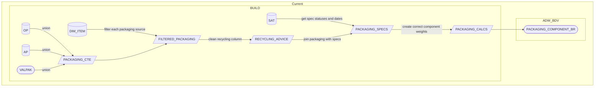

# PACKAGING_COMPONENT_BR

**Authors:** {{ git_page_authors }}  
**Revision Date:** {{ git_revision_date_localized }}

## Description

This object is the atomic level bridge table for packaging data. Containing both Evolve Food and Valpak, this performs all the cleaning and calculations that need to take place prior to being consumed in the PL layer. This object supports `DIM_PACKAGING_COMPONENT` and `ITEM_SPECIFICATION_COMPONENT_BR` which is a table that combines Sales, Supplier and Packaging data for the reporting requirements in Plan for Better Plastics.

## Selection Criteria

This BDV object contains two sources, as a result we must identify which data we want to take from each source and ensure no duplication in the data. We are also only concerned with own brand items. Valpak is GM, plus loose food & bakery, Evolve is all other food items. Filter criteria is based from ADW_BDV.ITEM_BR joining on ITEM_BR.ITEM_CD = PACKAGING.ITEM_CD, this criteria is applied in step 5 of the build.

**Own Brand Criteria**

```
OWN_BRAND_FLAG = 'Y'
```

**Valpak Criteria**

```
BUSINESS_UNIT_CD IN (5699,3210)
SUB_CAT_CD IN (184,319,325,350,353,438,468,502,503,533,607,654,849,850,856,876,877,880,881,882,883,884,886,887,888,889,891,892,893,894,895,896,912,913,929,943)
ELSE SUB_CAT_CD
```

**Evolve Criteria**

```
BUSINESS_UNIT_CD IN (5699,3210)
SUB_CAT_CD NOT IN (184,319,325,350,353,438,468,502,503,533,607,654,849,850,856,876,877,880,881,882,883,884,886,887,888,889,891,892,893,894,895,896,912,913,929,943)
```

## Target to Source

The below tables will be used in the build and have the following as aliases:

- `ADW_PRODUCT_TRAN.ITEM_PACKAGING_COMPONENT_VALPAK_HIST_BR_LOGIC_2` as `VALPAK`
- `ADW_RDV.ADVANCED_PACKAGING_COMPONENT_LINK` as `AP`
- `ADW_RDV.ITEM_SPECIFICATION_ITEM_PACKAGING_COMPONENT_LINK` as `OP`
- `ADW_RDV.ITEM_SPECIFICATION_EVOLVE_SAT` as `EVOLVE SAT`
- `ADW_RDV.ITEM_SPECIFICATION_MATERIAL_REF` as `MAT_REF`
- `ADW_PRODUCT_TRAN.EVOLVE_VALPAK_RECYCLE_ADVICE_REF` as `RECYCLING_ADVICE`
- `ADW_BDV.ITEM_BR`

Target system for this object is ADW_BDV.

{{ read_csv("./docs/csv/bdv-example.csv") }}

## Mapping Steps

1. Get data from AP with the below fields and add in the additional steps a to c:
      1. **Create Primary Key & Spec/Version Key:**
         - In packaging we need to combine a number of natural keys for a unique row, concatenate the below fields, this will be to target `PACKAGING_COMPONENT_CD`.
         - ```
           ITEM_NK1,  
           ITEM_SPEC_NK1,
           ITEM_SPEC_NK2,
           ITEM_PACKAGING_CD,
           ITEM_PACKAGING_COMPONENT_CD
           ```
         - In packaging the Specification & Version is a unique agreement between Sainsburys and the Supplier. Concatenate the below fields these will be used to join to the Evolve Sat.
         - ```
         ITEM_SPEC_NK1, ITEM_SPEC_NK2
         ```
      1. **Clean these columns:**
         - WHEN PACKAGING_COMPONENT_LEVEL = 'AP_PRIMARY' THEN `PRIMARY`
         - WHEN PACKAGING_COMPONENT_LEVEL = 'AP_SECONDARY' THEN `SECONDARY` 
         - WHEN PACKAGING_COMPONENT_LEVEL = 'AP_TERTIARY' THEN `TERTIARY`
      1. **All other Fields from AP to be brought in**
            ```
            PACKAGING_COMPONENT_COMPONENT
            PACKAGING_COMPONENT_EXTENDED_MATERIAL
            PACKAGING_COMPONENT_BASE_MATERIAL_DESC
            PACKAGING_COMPONENT_FOOD_CONTACT_IND
            PACKAGING_COMPONENT_COMPONENT_WEIGHT_GRAMS
            PACKAGING_COMPONENT_LENGTH_MM
            PACKAGING_COMPONENT_WIDTH_MM
            PACKAGING_COMPONENT_HEIGHT_MM
            PACKAGING_COMPONENT_COMPONENT_THICKNESS_MM
            PACKAGING_DETAIL_SPECIFICATION
            PACKAGING_DETAIL_MATERIAL_SPEC_TYPE
            PACKAGING_DETAIL_CLASSIFIED_AS_SINGLE_USE_PLASTIC
            PACKAGING_DETAIL_CLASSIFIED_AS_LONG_TERM_STORAGE_PACKAGING
            PACKAGING_DETAIL_INDUSTRIAL_COMPOSTABLE_TO_EN13432_DONT_RECYCLE
            PACKAGING_DETAIL_HOME_COMPOSTABLE_TO_OK_HOME_COMPOST_PROTOCAL_DONT_RECYCLE
            PACKAGING_DETAIL_TAMPER_EVIDENT
            PACKAGING_DETAIL_TAMPER_EVIDENT_FACTOR
            PACKAGING_DETAIL_NUMBER_OF_PRIMARY_PACKAGING_COMPONENTS_IN_EACH_RETAIL_UNIT_EG_MULTIPACK
            PACKAGING_DETAIL_NUMBER_OF_RETAIL_UNITS_IN_SECONDARY_OR_TERTIARY_PACKAGING_COMPONENT
            PACKAGING_DETAIL_PERCENT_POST_CONSUMER_RECYCLED_CONTENT
            PACKAGING_DETAIL_WEIGHT_OF_RECYCLED_GRAMS
            PACKAGING_DETAIL_COLOUR
            PACKAGING_DETAIL_ADHESIVE_TYPE
            PACKAGING_DETAIL_STRUCTURE
            PACKAGING_DETAIL_PRINT_METHOD
            PACKAGING_DETAIL_INK_TYPE
            PACKAGING_DETAIL_SUPPLIER_CERTIFICATION
            PACKAGING_DETAIL_SUPPLIER_CERTIFICATE_NUMBERS
            PACKAGING_DETAIL_PACKAGING_SUPPLIER
            PACKAGING_DETAIL_COUNTRY_OF_ORIGIN
            PACKAGING_QUESTIONS_CONTAINS_BISPHENOL_A
            PACKAGING_QUESTIONS_CONTAINS_METAL_HYDROXIDES
            PACKAGING_QUESTIONS_CONTAINS_PHTHALATES
            PACKAGING_QUESTIONS_CONTAINS_PHOTO_INITIATORS
            PACKAGING_QUESTIONS_CONTAINS_PFAS_PFOA_PFOS
            PACKAGING_PARENT
            EFFECTIVE_FROM_TS
            "ADVANCED_PACKAGING" AS SOURCE
            ```
1. Get data from OP with the below fields:
      1. ???+ Info "Primary Keys, Join Conditions & Column Alignment"
         - Create same keys as the steps in AP
         - JOIN TO ITEM_SPECIFICATION_MATERIAL_REF ON OP.MATERIAL_CD = MAT_REF.MATERIAL_CD  
         - The order and names of the columns will need to align to the structure in APto allow a union, when a column isn’t present in OP please add the AP column name filled with “NOT IN ORIGINAL PACKAGING” 
      1. **All other Fields from OP to be brought in**
         ```
         PACKAGING_COMPONENT_SUPPLIER
         ITEM_PACKAGING_COMPONENT_DESC
         ITEM_PACKAGING_COMPONENT_SPECIFICATION
         RECYCLED_PERCENT
         RECYCLED_WEIGHT
         COMPONENT_WEIGHT
         COMPONENT_COUNTRY_CD
         FOOD_CONTACT_FLAG
         CERTIFICATION
         PRINT_METHOD
         PACKAGING_LEVEL_DESC
         MATERIAL_DESC
         MATERIAL_SPEC_TYPE
         EFFECTIVE_FROM_TS
         "ORIGINAL_PACKAGING" AS SOURCE
         ```
1. Get data from VALPAK with the below fields:
      1. ???+ Info "Column Alignment" 
         - The order and names of the columns will need to align to the structure in AP to allow a union, when a column isn’t present in VALPAK please add the AP column name filled with “NOT IN VALPAK”
         - Valpak has surrogate keys as there aren't any natural keys in the data, you can use COMPONENT_VALPAK_SK_CD for PACKAGING_COMPONENT_CD and SPECIFICTION_VERSION_SK_CD for SPECIFICTION_VERSION_CD
      ```
      ITEM_CD
      RECYCLING_ADVICE_CD
      COMPONENT_WEIGHT_VALID_FROM_DT
      PACKAGING_LEVEL_DESC
      MATERIAL_UNIFORM_CD
      MATERIAL_UNIFORM_EXTENDED_MATERIAL
      ITEM_PACKAGING_COMPONENT_DESC
      MATERIAL_COLOUR
      AVERAGE_PACKAGING_RECYCLED_WEIGHT
      AVERAGE_PACKAGING_COMPONENT_WEIGHT
      RECYCLED_WEIGHT_PCT
      MULTIPACK_VALUE
      "VALPAK" AS SOURCE
      ```
1. Combine all three datasets so we have our base packaging content, for the purposes of the steps this will be called PACKAGING.
1. Filter PACKAGING sources based on the selection criteria given to ensure correct items are coming from each source.
1. Apply recycling advice cleaning to Evolve & Valpak. Left Join to ADW_PRODUCT_TRAN.EVOLVE_VALPAK_RECYCLE_ADVICE_REF on PACKAGING.SOURCE = SOURCE AND PACKAGING.RECYCLING_ADVICE_DESC = OP_AP_VALPAK_RECYCLING_ADVICE and return RECYCLING_ADVICE AS RECYCLING_ADVICE_DESC. 
1. Get data from EVOLVE_SAT with the below fields, this is so we can see what components were listed against a spec in a particular time period.
      1. **Create Spec/Version Key**
         - In packaging the Specification & Version is a unique agreement between Sainsburys and the Supplier. Concatenate the below fields these will be used to join to the Evolve Sat.
         - 
         ```
         ITEM_SPEC_NK1, ITEM_SPEC_NK2
         ```
      1. **All other Fields from EVOLVE_SAT to be brought in**  
         -  
         ```
         ITEM_SPEC_STATUS
         ISMULTI_PACK_FLAG
         EFFECTIVE_FROM_TS AS VALID_FROM_DT
         ```
      1. Add in a VALID_TO_DT using EFFECTIVE_FROM_TS - 1 of the new SPECIFICATION_CD.
1. Inner Join EVOLVE_SAT to PACKAGING ON: EVOLVE_SAT.SPECIFICATION_VERSION_CD = PACKAGING.SPECIFICATION_VERSION_CD.
1. Apply calculations and transformations on packaging data weights. See calculations section for more detail.
      1. ???+ example "Calculations"
         **Secondary**
         An item has secondary packaging, this is not sold to the consumer and will be for example a box containing multiple skus. We must divide the weight of this secondary component to give an actual value sold per item as to not inflate the overall packaging weight of the item.
         ```
         COMPONENT_WEIGHT / CASE_CRATE_SHIPPER_QTY
         Example :
         Case component weight = 352.59 g
         Case crate shipper quantity = 12
         Secondary Calculated weight = 352.59/12 = 29.3 g
         ```
         **Tertiary**
         Similar to the secondary calculation there is also tertiary packaging. This will usually be the pallet and any materials used to secure the pallet. Again we need to divide the weights to provide a correct weight per item.
         ```
         COMPONENT_WEIGHT / (CASE_CRATE_SHIPPER_QTY * TOTAL_CASES_PER_PALLET_LAYER_QTY)
         Example :
         Stretch Wrap component weight = 250
         Case crate shipper quantity = 12
         Case crate total cases per pallet = 42
         Tertiary Calculated weight = 250/(12*42) = 0.49603 g
         ```
         **Multipack Calculation**
         This is the opposite of the previous two calculations. When we sell multipacks the weight assigned is only equivalent to one item. In this case we must multiply the weight by the no. of items in the pack.
         ```
         CONSUMER_PACK_QTY * COMPONENT_WEIGHT
         Example :
         Component weight from Evolve for bottle = 34 gm
         Calculated Weight for Bottle = 4 * 34 gm = 136 gm
         ```
         **Recycled Weight Calculation**
         ```
         Calculated Recycled Content Weight =% Recycled Content * Calculated Component Weight
         ```
         **Multiple supplier component Calculation**
         A spefication and version has multiple suppliers of a component, for example in our data we will have three entries against a bottle, however only one bottle will have sold in the store. Therefore we have to take this into consideration when building both fact views. For packaging we have worked out the average value of the three components, then divided by the no. of components to give an accurate figure when rolling up to the views consumed by the business:
         ```
         Bottle 32g,Bottle 36g, Bottle 33g
         Average value = 33.6 g / 3 = 11.2 g
         ```
1. Build out final view in column order of the DDL.
1. Load transform schema to ADW_BDV.PACKAGING_COMPONENT_BR.
1. End.

## Diagram



## Tests & Checks

Please evidence checks below:

- [ ] No duplicate spec & version across the 3 sources
- [ ] Unique row per primary keys. PACKAGING_COMPONENT_CD & VALID_FROM_DT/VALID_TO_DT
- [ ] All weight calculations applied
- [ ] Recycling Advice has been cleaned


