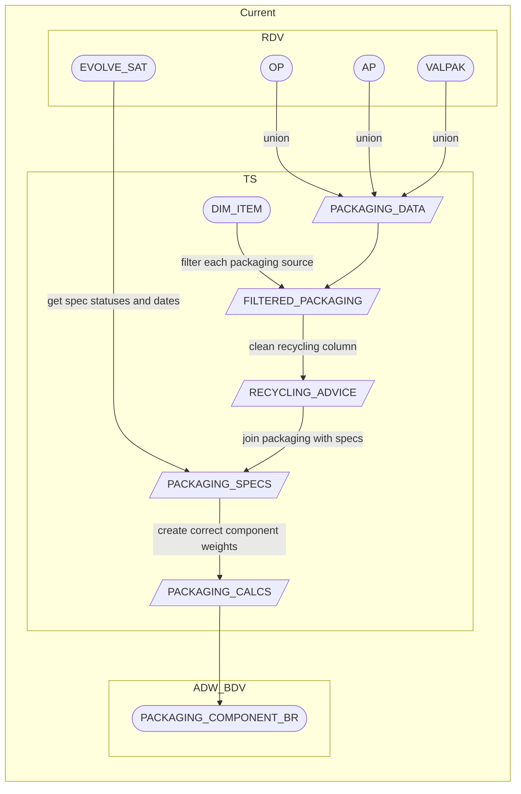

# PACKAGING_COMPONENT_BR

**Authors:** {{ git_page_authors }}  
**Revision Date:** {{ git_revision_date_localized }}

## Description

This object is the atomic level bridge table for packaging data. Containing both Evolve Food and Valpak, this performs all the cleaning and calculations that need to take place prior to being consumed in the PL layer. This object supports `DIM_PACKAGING_COMPONENT` and `ITEM_SPECIFICATION_COMPONENT_BR` which is a table that combines Sales, Supplier and Packaging data for the reporting requirements in Plan for Better Plastics.

## Selection Criteria

This BDV object contains two sources, as a result we must identify which data we want to take from each source and ensure no duplication in the data. We are also only concerned with own brand items. Valpak is GM, plus loose food & bakery, Evolve is all other food items. Filter criteria is based from ADW_BDV.ITEM_BR joining on ITEM_BR.ITEM_CD = PACKAGING.ITEM_CD, this criteria is applied in step 5 of the build.

**Own Brand Criteria**

```
OWN_BRAND_FLAG = 'Y'
```

**Valpak Criteria**

```
BUSINESS_UNIT_CD IN (5699,3210)
SUB_CAT_CD IN (184,319,325,350,353,438,468,502,503,533,607,654,849,850,856,876,877,880,881,882,883,884,886,887,888,889,891,892,893,894,895,896,912,913,929,943)
ELSE SUB_CAT_CD
```

**Evolve Criteria**

```
BUSINESS_UNIT_CD IN (5699,3210)
SUB_CAT_CD NOT IN (184,319,325,350,353,438,468,502,503,533,607,654,849,850,856,876,877,880,881,882,883,884,886,887,888,889,891,892,893,894,895,896,912,913,929,943)
```

## Target to Source

The below tables will be used in the build and have the following as aliases:

- `ADW_PRODUCT_TRAN.ITEM_PACKAGING_COMPONENT_VALPAK_HIST_BR_LOGIC_2` as `VALPAK`
- `ADW_RDV.ADVANCED_PACKAGING_COMPONENT_LINK` as `AP`
- `ADW_RDV.ITEM_SPECIFICATION_ITEM_PACKAGING_COMPONENT_LINK` as `OP`
- `ADW_RDV.ITEM_SPECIFICATION_EVOLVE_SAT` as `EVOLVE SAT`
- `ADW_RDV.ITEM_SPECIFICATION_MATERIAL_REF` as `MAT_REF`
- `ADW_PRODUCT_TRAN.EVOLVE_VALPAK_RECYCLE_ADVICE_REF` as `RECYCLING_ADVICE`
- `ADW_BDV.ITEM_BR`

**Target System:** ADW_BDV  
**Target Table:** ITEM_PACKAGING_COMPONENT_BR  
**Target to Source Mapping:**

1. <div id="PACKAGING_COMPONENT_CD"></div> *[PACKAGING_COMPONENT_CD](#PACKAGING_COMPONENT_CD Logic):
      1. `AP` - ITEM_NK1,ITEM_SPEC_NK1,ITEM_SPEC_NK2,ITEM_PACKAGING_CD,ITEM_PACKAGING_COMPONENT_CD
      1. `OP` - ITEM_NK1,ITEM_SPEC_NK1,ITEM_SPEC_NK2,ITEM_PACKAGING_CD,ITEM_PACKAGING_COMPONENT_CD
      1. `VALPAK` - PACKAGING_COMPONENT_SK_CD
1. <div id="VALID_FROM_DT"></div> *[VALID_FROM_DT](#VALID_FROM_DT Logic):
      1. `EVOLVE_SAT` - EFFECTIVE_FROM_TS
      1. `VALPAK` - VALID_FROM_DT
1. <div id="VALID_TO_DT"></div> *[VALID_TO_DT](#VALID_TO_DT Logic):
      1. `EVOLVE_SAT` - Add in a VALID_TO_DT using EFFECTIVE_FROM_TS - 1 of the new SPECIFICATION_CD
      1. `VALPAK` - VALID_TO_DT
1. <div id="ITEM_CD"></div> *[ITEM_CD](#ITEM_CD Logic)
      1. `AP` - ITEM_NK1
      1. `OP` - ITEM_NK1
      1. `VALPAK` - ITEM_CD
1. <div id="SPECIFICATION_VERSION_CD"></div> *[SPECIFICATION_VERSION_CD](#SPECIFICATION_VERSION_CD Logic):
      1. `EVOLVE_SAT` - ITEM_SPEC_NK1, ITEM_SPEC_NK2
      1. `VALPAK` - SPECIFICATION_VERSION_SK_CD
1. <div id="SPECIFICATION_STATUS"></div> *[SPECIFICATION_STATUS](#SPECIFICATION_STATUS Logic)
      1. `EVOLVE_SAT` - SPECIFICATION_STATUS
      1. `VALPAK` - 
1. <div id="PACKAGING_CD"></div> *[PACKAGING_CD](#PACKAGING_CD Logic)
      1. `AP` - ITEM_PACKAGING_CD
      1. `OP` - ITEM_PACKAGING_CD
      1. `VALPAK` - -2
1. <div id="COMPONENT_CD"></div> *[COMPONENT_CD](#COMPONENT_CD Logic)
      1. `AP` - ITEM_PACKAGING_COMPONENT_CD
      1. `OP` - ITEM_PACKAGING_COMPONENT_CD
      1. `VALPAK` - PACKAGING_COMPONENT_SK_CD
1. <div id="COMPONENT_DESC"></div> *[COMPONENT_DESC](#COMPONENT_DESC Logic)
      1. `AP` - PACKAGING_COMPONENT_COMPONENT
      1. `OP` - ITEM_PACKAGING_COMPONENT_DESC
      1. `VALPAK` - ITEM_PACKAGING_COMPONENT_DESC
1. <div id="COMPONENT_LEVEL_DESC"></div> *[COMPONENT_LEVEL_DESC](#COMPONENT_LEVEL_DESC Logic)
      1. `AP` - PACKAGING_COMPONENT_LEVEL
      1. `OP` - PACKAGING_LEVEL_DESC
      1. `VALPAK` - PACKAGING_LEVEL_DESC
1. <div id="COMPONENT_MATERIAL_DESC"></div> *[COMPONENT_MATERIAL_DESC](#COMPONENT_MATERIAL_DESC Logic)
      1. `AP` - PACKAGING_COMPONENT_BASE_MATERIAL_DESC
      1. `OP` - MATERIAL_DESC
      1. `VALPAK` - MATERIAL_UNIFORM_CD
1. <div id="COMPONENT_EXTENDED_MATERIAL_DESC"></div> *[COMPONENT_EXTENDED_MATERIAL_DESC](#COMPONENT_EXTENDED_MATERIAL_DESC Logic)
      1. `AP` - COMPONENT_EXTENDED_MATERIAL_DESC
      1. `OP` MATERIAL_SPEC_TYPE
      1. `VALPAK` - MATERIAL_UNIFORM_EXTENDED_MATERIAL
1. <div id="COMPONENT_SPECIFICATION_DESC"></div> *[COMPONENT_SPECIFICATION_DESC](#COMPONENT_SPECIFICATION_DESC Logic)
      1. `AP` - PACKAGING_DETAIL_SPECIFICATION
      1. `OP` - ITEM_PACKAGING_COMPONENT_SPECIFICATION
      1. `VALPAK` - ~~
1. <div id="RECYCLING_ADVICE_DESC"></div> *[RECYCLING_ADVICE_DESC](#RECYCLING_ADVICE_DESC Logic)
      1. RECYCLING_ADVICE_ICON
      1. MATERIAL_DESC
      1. RECYCLING_ADVICE_CD
1. <div id="COMPONENT_COLOUR"></div> *[COMPONENT_COLOUR](#COMPONENT_COLOUR Logic)
      1. PACKAGING_DETAIL_COLOUR
      1. ~~
      1. MATERIAL_COLOUR
1. <div id="COMPONENT_WEIGHT_GRAMS"></div> *[COMPONENT_WEIGHT_GRAMS](#COMPONENT_WEIGHT_GRAMS Logic)
      1. PACKAGING_COMPONENT_COMPONENT_WEIGHT_GRAMS
1. <div id="CALCULATED_COMPONENT_WEIGHT_GRAMS"></div> *[CALCULATED_COMPONENT_WEIGHT_GRAMS](#CALCULATED_COMPONENT_WEIGHT_GRAMS Logic)
      1. **Secondary**   
      An item has secondary packaging, this is not sold to the consumer and will be for example a box containing multiple skus. We must divide the weight of this secondary component to give an actual value sold per item as to not inflate the overall packaging weight of the item.  
            ```
            COMPONENT_WEIGHT / CASE_CRATE_SHIPPER_QTY  
            Example :
            Case component weight = 352.59 g
            Case crate shipper quantity = 12
            Secondary Calculated weight = 352.59/12 = 29.3 g
            ```
      1. "Tertiary"  
      Similar to the secondary calculation there is also tertiary packaging. This will usually be the pallet and any materials used to secure the pallet. Again we need to divide the weights to provide a correct weight per item.
            ```
            COMPONENT_WEIGHT / (CASE_CRATE_SHIPPER_QTY * TOTAL_CASES_PER_PALLET_LAYER_QTY)
            Example :
            Stretch Wrap component weight = 250
            Case crate shipper quantity = 12
            Case crate total cases per pallet = 42
            Tertiary Calculated weight = 250/(12*42) = 0.49603 g
            ```
      1. "Multipack Calculation" 
      This is the opposite of the previous two calculations. When we sell multipacks the weight assigned is only equivalent to one item. In this case we must multiply the weight by the no. of items in the pack.
            ```
            CONSUMER_PACK_QTY * COMPONENT_WEIGHT
            Example :
            Component weight from Evolve for bottle = 34 gm
            Calculated Weight for Bottle = 4 * 34 gm = 136 gm
            ```
      1. "Recycled Weight Calculation"
      ```
      Calculated Recycled Content Weight =% Recycled Content * Calculated Component Weight
      ```
      1. "Multiple supplier component Calculation" 
      A spefication and version has multiple suppliers of a component, for example in our data we will have three entries against a bottle, however only one bottle will have sold in the store. Therefore we have to take this into consideration when building both fact views. For packaging we have worked out the average value of the three components, then divided by the no. of components to give an accurate figure when rolling up to the views consumed by the business:
            ```
            Bottle 32g,Bottle 36g, Bottle 33g
            Average value = 33.6 g / 3 = 11.2 g
            ```
1. <div id="COMPONENT_RECYCLED_WEIGHT_GRAMS"></div> *[COMPONENT_RECYCLED_WEIGHT_GRAMS](#COMPONENT_RECYCLED_WEIGHT_GRAMS Logic)
      1. `AP` - PACKAGING_DETAIL_WEIGHT_OF_RECYCLED_GRAMS
      2. `OP` - RECYCLED_WEIGHT
      3. `VALPAK` - AVERAGE_PACKAGING_RECYCLED_WEIGHT
1. <div id="CALCULATED_RECYCLED_WEIGHT_GRAMS"></div> *[CALCULATED_RECYCLED_WEIGHT_GRAMS](#CALCULATED_RECYCLED_WEIGHT_GRAMS Logic)
1. <div id="COMPONENT_RECYCLED_PCT"></div> *[COMPONENT_RECYCLED_PCT](#COMPONENT_RECYCLED_PCT Logic)
      1. `AP` - PACKAGING_DETAIL_PERCENT_POST_CONSUMER_RECYCLED_CONTENT
      2. `OP` - RECYCLED_PERCENT
      3. `VALPAK` - RECYCLED_WEIGHT_PCT
1. <div id="MULTIPACK_UNITS"></div> *[MULTIPACK_UNITS](#MULTIPACK_UNITS Logic)
      1. `AP` - PACKAGING_DETAIL_NUMBER_OF_PRIMARY_PACKAGING_COMPONENTS_IN_EACH_RETAIL_UNIT_EG_MULTIPACK 
      1. `OP` ~~
      1. `VALPAK` - MULTIPACK_VALUE
1. <div id="NUMBER_OF_RETAIL_UNITS_IN_SECONDARY_OR_TERTIARY_PACKAGING"></div> *[NUMBER_OF_RETAIL_UNITS_IN_SECONDARY_OR_TERTIARY_PACKAGING](#NUMBER_OF_RETAIL_UNITS_IN_SECONDARY_OR_TERTIARY_PACKAGING Logic)
      1. `AP` - PACKAGING_DETAIL_NUMBER_OF_RETAIL_UNITS_IN_SECONDARY_OR_TERTIARY_PACKAGING_COMPONENT
      1. `OP` - ~~
      1. `VALPAK` - ~~
1. <div id="COMPONENT_LENGTH_MM"></div> *[COMPONENT_LENGTH_MM](#COMPONENT_LENGTH_MM Logic)
      1. `AP` - PACKAGING_COMPONENT_LENGTH_MM
      1. `OP` - ~~
      1. `VALPAK` - ~~
1. <div id="COMPONENT_WIDTH_MM"></div> *[COMPONENT_WIDTH_MM](#COMPONENT_WIDTH_MM Logic)
      1. `AP` - PACKAGING_COMPONENT_WIDTH_MM
      1. `OP` - ~~
      1. `VALPAK` - ~~
1. <div id="COMPONENT_HEIGHT_MM"></div> *[COMPONENT_HEIGHT_MM](#COMPONENT_HEIGHT_MM Logic)
      1. `AP` - PACKAGING_COMPONENT_HEIGHT_MM
      1. `OP` - ~~
      1. `VALPAK` - ~~
1. <div id="FOOD_CONTACT_FLAG"></div> *[FOOD_CONTACT_FLAG](#FOOD_CONTACT_FLAG Logic)
      1. `AP` - PACKAGING_COMPONENT_FOOD_CONTACT_IND
      1. `OP` - FOOD_CONTACT_FLAG
      1. `VALPAK` - ~~
1. <div id="SINGLE_USE_PLASTIC_FLAG"></div> *[SINGLE_USE_PLASTIC_FLAG](#SINGLE_USE_PLASTIC_FLAG Logic)
      1. `AP` - PACKAGING_DETAIL_CLASSIFIED_AS_SINGLE_USE_PLASTIC
      1. `OP` - ~~
      1. `VALPAK` - ~~
1. <div id="LONG_TERM_STORAGE_FLAG"></div> *[LONG_TERM_STORAGE_FLAG](#LONG_TERM_STORAGE_FLAG Logic)
      1. `AP` - PACKAGING_DETAIL_CLASSIFIED_AS_LONG_TERM_STORAGE_PACKAGING
      1. `OP` - ~~
      1. `VALPAK` - ~~
1. <div id="INDUSTRIAL_COMPOSTABLE_FLAG"></div> *[INDUSTRIAL_COMPOSTABLE_FLAG](#INDUSTRIAL_COMPOSTABLE_FLAG Logic)
      1. `AP` - PACKAGING_DETAIL_INDUSTRIAL_COMPOSTABLE_TO_EN13432_DONT_RECYCLE
      1. `OP` - ~~
      1. `VALPAK` - ~~
1. <div id="HOME_COMPOSTABLE_RECYCLE_FLAG"></div> *[HOME_COMPOSTABLE_RECYCLE_FLAG](#HOME_COMPOSTABLE_RECYCLE_FLAG Logic)
      1. `AP` - PACKAGING_DETAIL_HOME_COMPOSTABLE_TO_OK_HOME_COMPOST_PROTOCAL_DONT_RECYCLE
      1. `OP` - ~~
      1. `VALPAK` - ~~
1. <div id="TAMPER_EVIDENT_FLAG"></div> *[TAMPER_EVIDENT_FLAG](#TAMPER_EVIDENT_FLAG Logic)
      1. `AP` - PACKAGING_DETAIL_TAMPER_EVIDENT
      1. `OP` - ~~
      1. `VALPAK` - ~~
1. <div id="TAMPER_EVIDENT_FACT_FLAG"></div> *[TAMPER_EVIDENT_FACT_FLAG](#TAMPER_EVIDENT_FACT_FLAG Logic)
      1. `AP` - PACKAGING_DETAIL_TAMPER_EVIDENT_FACTOR
      1. `OP` - ~~
      1. `VALPAK` - ~~
1. <div id="COMPONENT_SUPPLIER"></div> *[COMPONENT_SUPPLIER](#COMPONENT_SUPPLIER Logic)
      1. `AP` - PACKAGING_DETAIL_PACKAGING_SUPPLIER
      1. `OP` - PACKAGING_COMPONENT_SUPPLIER
      1. `VALPAK` - ~~
1. <div id="COMPONENT_COUNTRY_OF_ORIGIN"></div> *[COMPONENT_COUNTRY_OF_ORIGIN](#COMPONENT_COUNTRY_OF_ORIGIN Logic)
      1. `AP` - PACKAGING_DETAIL_COUNTRY_OF_ORIGIN
      1. `OP` - COMPONENT_COUNTRY_CD
      1. `VALPAK` - ~~
1. <div id="COMPONENT_SUPPLIER_CERTIFICATION"></div> *[COMPONENT_SUPPLIER_CERTIFICATION](#COMPONENT_SUPPLIER_CERTIFICATION Logic)
      1. `AP` - PACKAGING_DETAIL_SUPPLIER_CERTIFICATION
      1. `OP` - CERTIFICATION
      1. `VALPAK` - ~~
1. <div id="TECHNICAL_METADATA"></div> *[TECHNICAL_METADATA](#TECHNICAL_METADATA Logic)

## Diagram



## Tests & Checks

Please evidence checks below:

- [ ] No duplicate spec & version across the 3 sources
- [ ] Unique row per primary keys. PACKAGING_COMPONENT_CD & VALID_FROM_DT/VALID_TO_DT
- [ ] All weight calculations applied
- [ ] Recycling Advice has been cleaned


