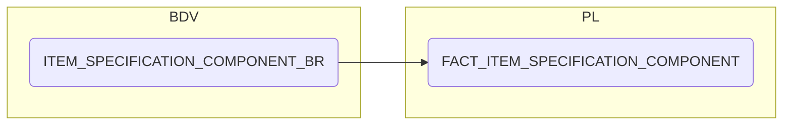

# FACT_ITEM_SPECIFICATION_COMPONENT

**Authors:** {{ git_page_authors }}  
**Revision Date:** {{ git_revision_date_localized }}

## Description

This object is the atomic level fact view for packaging. Containing component level data, this view intends to analyse all packaging types at all packaging levels. The view is set to calendar month to aid in EPR reporting.

## Selection Criteria

This object is built from ITEM_SPECIFICATION_COMPONENT_BR, that tables time granulairty is date. For this view calendar month is required, lookup TRAN_DT against DIM_DATE.DATE_DT and return CALNDR_PERIOD_NUM.

## Target to Source

{{ read_excel('../Mapping Spec Git.xlsx', engine='openpyxl', sheet_name="FACT_ITEM_SPECIFICATION_COMPONE") }}

## Mapping Steps

1. This is a simple build almost taking an exact replica of ITEM_SPECIFICATION_COMPONENT_BR, however there is one requirement to aggregate the data to CALNDR_PERIOD_NUM instead of TRAN_DT.
1. Join the BR table to DIM_DATE using TRAN_DT = DATE_DT
1. Concatenate the below keys with ~ in between each key as PACKAGING_COMPONENT_CD
   ```
   ITEM_CD
   SPECIFICATION_VERSION_CD
   PACKAGING_CD
   COMPONENT_CD
   ```
   This is the primary key to link to DIM_PACKAGING_COMPONENT
1. Aggregate metrics to CALNDR_PERIOD_NUM
1. SUM(COMPONENT_RECYCLED_WEIGHT)/SUM(COMPONENT_WEIGHT) for RECYCLED_WEIGHT_PCT
1. End

## Diagram



## Tests & Checks

- [ ] Object is aggregated to calendar month
- [ ] Object metrics deaggregate to source table values
