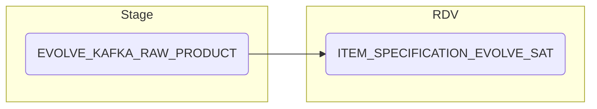

# ITEM SPECIFICATION EVOLVE SAT

**Authors:** {{ git_page_authors }}  
**Revision Date:** {{ git_revision_date_localized }}

## Description

This is the Satellite for Evolve Food, sourced from the Evolve System and stage table Evolve Kafka Raw Product. The object contains Specification & Versions as NK1 & NK2, these are the unique agreements between Sainsburys and a supplier. The object also contains key status changes and the dates related to those.

## Selection Criteria

Within the Evolve Kafka topic there are five categories `Food,FNF,BWS,CNF,Produce`. When loading to certain columns which is specified in the source to target you will need to map to the below to capture every category in the load.

**Source Criteria**
```
IF ret/specTypeFormat/specType = FOOD THEN ret/specificationSectionDetail/specificationSectionFoodMainDetailsSection/"followed by relevant field"
IF ret/specTypeFormat/specType = FNF THEN ret/specificationSectionDetail/specificationSectionFNFMainDetailsSection/"followed by relevant field" 
IF ret/specTypeFormat/specType = BWS THEN ret/specificationSectionDetail/specificationSectionBWSMainDetailsSection/"followed by relevant field"
IF ret/specTypeFormat/specType = CNF THEN ret/specificationSectionDetail/specificationSectionCNFMainDetailsSection/"followed by relevant field"
IF ret/specTypeFormat/specType = PRODUCE THEN ret/specificationSectionDetail/specificationSectionProduceMainDetailsSection/"followed by relevant field"
```

## Target to Source

* `ADW_STAGE.EVOLVE_KAFKA_RAW_PRODUCT`

Target system for this object is ADW_RDV.

{{ read_excel('..//Mapping Spec Git.xlsx', engine='openpyxl', sheet_name="RDV_EXAMPLE") }}

## Mapping Steps

1. Make sure all product categories are captured during the build as per the selection criteria.
1. Build view.
1. Load transform schema to ITEM_SPECIFICATION_EVOLVE_SAT.
1. End.

## Diagram



## Tests & Checks
Tests (To be defined post handover - Duplicate as required):

- [ ] New Test Scenario 1
- [ ] New Test Scenario 2
- [ ] New Test Scenario 3
- [ ] New Test Scenario 4