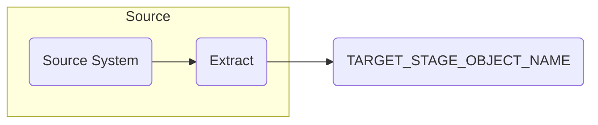

# INSERT STAGE OBJECT NAME HERE

**Authors:** {{ git_page_authors }}  
**Revision Date:** {{ git_revision_date_localized }}

## Description

Provide a brief description of the stage table, include specifics of source and the use case for ASPIRE.

## Diagram

